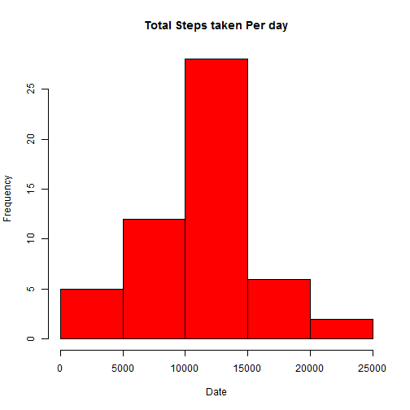
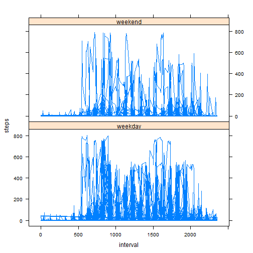

```r
setwd("C:/RworkingDirectory")
getwd()
```

```
## [1] "C:/RworkingDirectory"
```

```r
act <- read.csv("activity.csv", header=TRUE, sep=',')
## subset of observations without missing data

act1 <- subset(act, !is.na(steps))

actmean <- aggregate(steps ~ date, data = act1, mean)
actmedian <- aggregate(steps ~ date, data = act1, median)

## total steps taken per day

actsum <- aggregate(steps ~ date, data = act1, sum)
```

You can also embed plots, for example:


```r
with(actsum, hist(actsum$steps, main = "Total Steps taken Per day",xlab = "Date", col = "red"))
```

 


```r
##  mean of steps by interval accross all days

actIntmean <- aggregate(steps ~ interval, data = act1, mean)


## Interval with max number of steps

actIntmean[which.max(actIntmean$steps), ]
```

```
##     interval    steps
## 104      835 206.1698
```


```r
## get the total number of observation with a NA in the steps
library(lattice)
 nrow(subset(act, is.na(steps)))
```

```
## [1] 2304
```

```r
## Draw time series plot with 5 minute interval on the x-axis and steps on the y-axis

xyplot( steps ~ interval ,data = actIntmean, type = "l")
```

 

## filling the NA(missing vlaue ) with interval mean steps accross all days


```r
actfd <- act

for (i in 1: nrow(actIntmean)) { int <- actIntmean[i,1] ; st <- actIntmean[i,2] ;
  
    c <- which(is.na(actfd$steps) & actfd$interval == int)
    for (ct in 1:length(c)) { actfd[c[ct],1] <- st }
   
  }
head(actfd,5)
```

```
##       steps       date interval
## 1 1.7169811 2012-10-01        0
## 2 0.3396226 2012-10-01        5
## 3 0.1320755 2012-10-01       10
## 4 0.1509434 2012-10-01       15
## 5 0.0754717 2012-10-01       20
```

```r
library(lubridate)
actfd$wkday <- wday(ymd(actfd$date))
actfd[which(actfd$wkday > 2),  4] <- "weekday"
actfd[which(actfd$wkday == 1 | actfd$wkday == 2 ),  4] <- "weekend"

## Panel Plot
library(lattice)
xyplot(steps ~ interval | as.factor(wkday), data = actfd, type = "l", layout = c(1,2))
```

 
